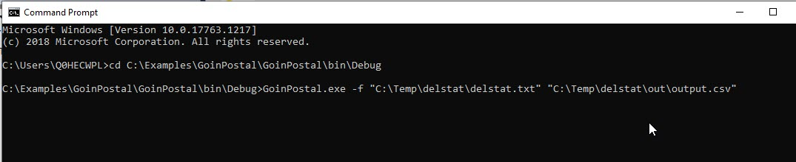
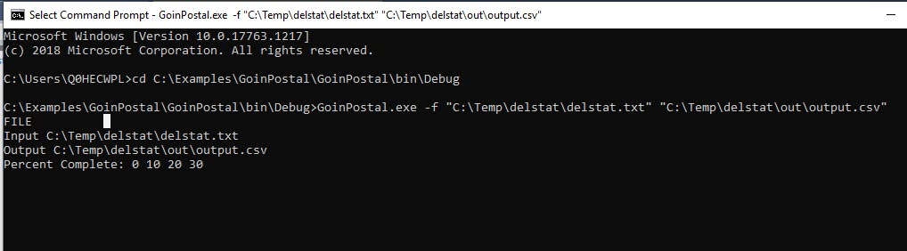

# GoinPostal
In order to run this program open command prompt. Change directory to the directory of the compiled executable using the change directory command cd <Path to exe>
  
To convert a single file use the -f command with the input file and the output file, for best practice quote the file path strings.

The program should run and provide progress reporting and summarize your inputs. When the project is complete there should be a csv where you defined the output. If the output file already exists the program alerts you it aborted.

[Download EXE here](https://drive.hecdev.net/share/UwtFQiB1)
